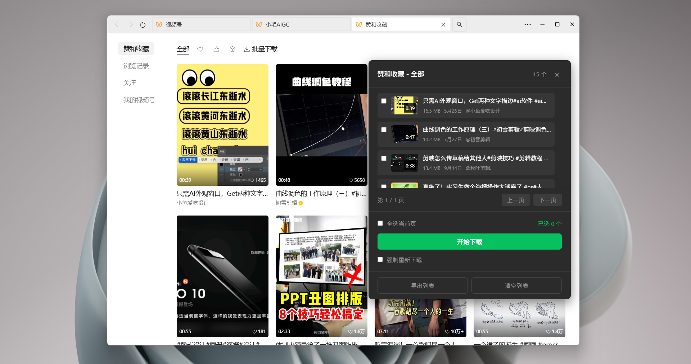

# 资源文件目录

此目录存放项目相关的图片和资源文件。

## 📸 图片文件

### 文档截图
- `jietu.png` - 主界面截图
- `liang.png` - 功能演示图
- `pinglun.png` - 评论功能截图
- `sous.png` - 搜索功能截图
- `wxq.png` - 微信视频号界面

### 其他图片
- `an.png` - 按钮示例
- `zanshang.png` - 赞赏码

## 📝 使用说明

### 在文档中引用图片

**Markdown 格式：**
```markdown

```

**示例：**
```markdown

```

### 相对路径

- 从根目录引用：`assets/图片名.png`
- 从 docs 目录引用：`../assets/图片名.png`
- 从 dev-docs 目录引用：`../assets/图片名.png`

## 🎨 图片规范

- **格式**：优先使用 PNG 格式（支持透明背景）
- **命名**：使用小写字母和下划线，如 `main_interface.png`
- **大小**：尽量压缩图片大小，建议单个文件不超过 500KB
- **分辨率**：截图建议使用 1920x1080 或更高分辨率

## 📁 目录结构

```
assets/
├── README.md           # 本文件
├── jietu.png          # 主界面截图
├── liang.png          # 功能演示图
├── pinglun.png        # 评论功能截图
├── sous.png           # 搜索功能截图
├── wxq.png            # 微信视频号界面
├── an.png             # 按钮示例
└── zanshang.png       # 赞赏码
```

## 🔄 更新图片

1. 将新图片放入 `assets/` 目录
2. 使用有意义的文件名
3. 在文档中更新图片引用
4. 提交到 Git 仓库

## 注意事项

- ⚠️ 不要上传过大的图片文件
- ⚠️ 确保图片不包含敏感信息
- ⚠️ 删除图片前检查是否有文档引用
- ✅ 定期清理不再使用的图片

---

**最后更新：** 2026-01-18
